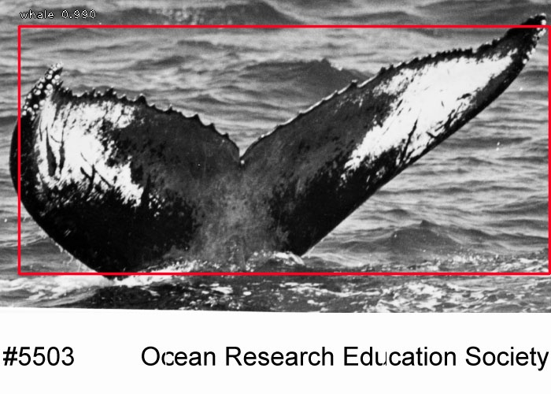
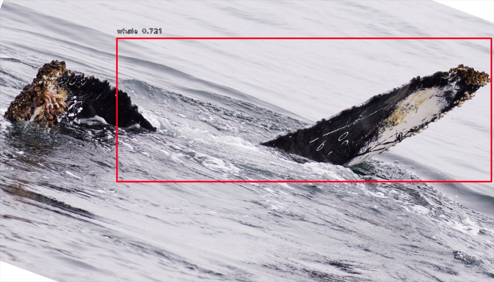
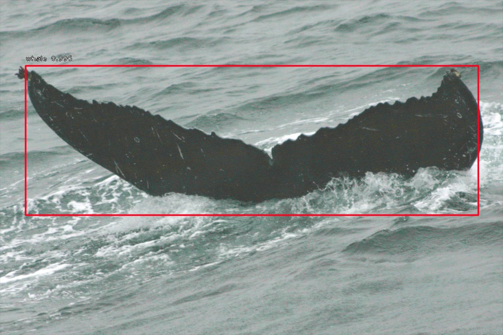
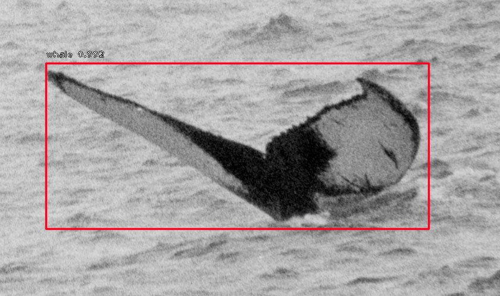
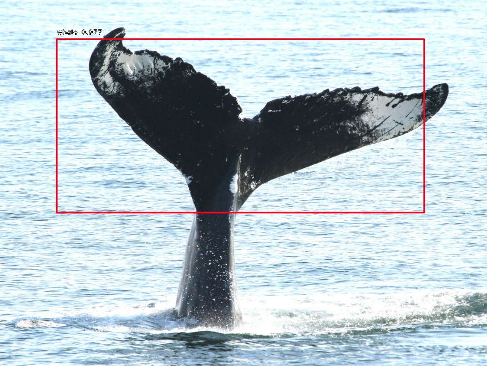
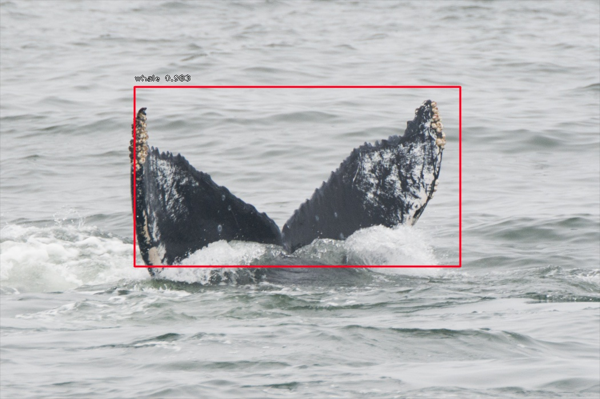

# Whale Detection using RetinaNet

## Achieves an **mAP of .96**.
#### Dataset: https://www.kaggle.com/c/whale-categorization-playground/data, using 1200 tagged bounding boxes. Trained on 960/1200 images.

